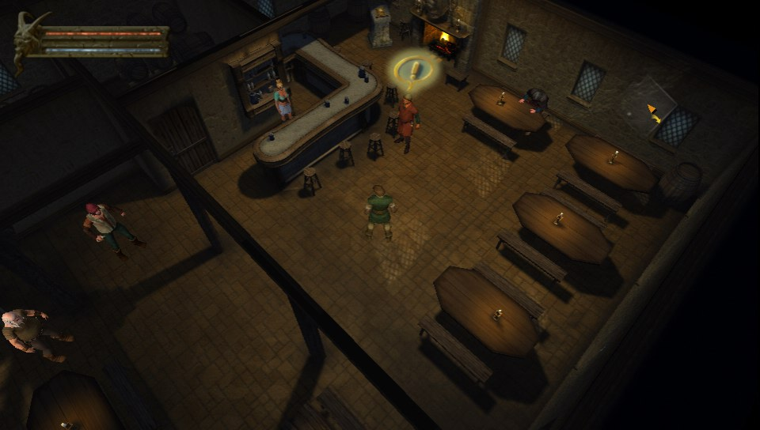
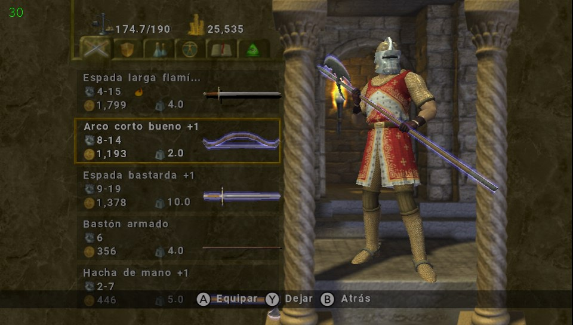
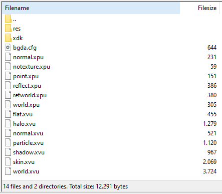
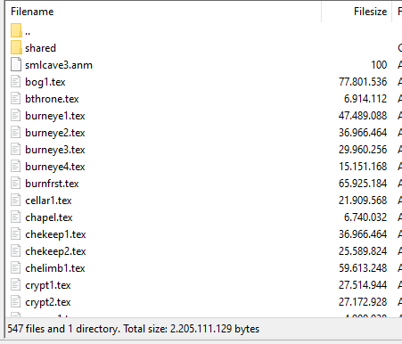

# Baldur's Gate: Dark Alliance Vita

<p align="center"></p>
<p align="center"></p>

This is a wrapper/port of <b>Baldur's Gate: Dark Alliance</b> for the *PS Vita*.

The port works by loading the official Android ARMv7 executables in memory, resolving its imports with native functions and patching it in order to properly run.
By doing so, it's basically as if we emulate a minimalist Android environment in which we run natively the executable as is.

# Changelog
### v1.04
- Fixed crashes/freezes right before the loading screen when entering a new level. This happened after playing for a while and changing levels a few times due to a memory leak from the loading screen thread.
- Fixed crash during the ending cutscene after defeating the final boss.
- Enabled 2x antialias as the impact in performance seems negligible.

### v1.03
- Support for L2/R2 button emulation using rear touch panel
- Disabled logs in VitaGL options

### v1.02
- Fixed Italian language not being set correctly

### v1.01
- Fixes for typo in live area game title

### v1.0
- Initial release.

## Known Issues
- Low framerate during video playing, including main menu due to CPU video decoding.
- Slight framerate spikes every few seconds in some levels due to vorbis audio decoding in main thread.
- Missing real-time shadows from characters and enemies. Temporarily disabled for performance.
- Achievements not working yet.
- Some levels with lots of vegetation and water have performance issues. Ex: the Rotting Bog.
- 2 player coop with 2 controllers is implemented, but **only works if both controllers are connected before launching the game**.

## Notes
- If performance drops in some levels or the game slows down, locking to 30FPS can help. This is done in the game settings menu by enabling Battery Saving.
- The game will set the language to your Vita's system language. It has been mostly tested in Spanish and English, but other versions such as Italian, French or German might have issues with audio/texts or even crashes. If you find any problems, feel free to open an Issue.
- For 2-player coop, if you are using a handheld Vita (not Vita TV) you need to install this plugin: https://github.com/TheOfficialFloW/MiniVitaTV
  
## Setup Instructions (For End Users)
In order to properly install the game, you'll have to follow these steps precisely:

- Install [kubridge](https://github.com/TheOfficialFloW/kubridge/releases/) and [FdFix](https://github.com/TheOfficialFloW/FdFix/releases/) by copying `kubridge.skprx` and `fd_fix.skprx` to your taiHEN plugins folder (usually `ux0:tai`) and adding two entries to your `config.txt` under `*KERNEL`:
  
```
  *KERNEL
  ux0:tai/kubridge.skprx
  ux0:tai/fd_fix.skprx
```

**Note** Don't install fd_fix.skprx if you're using rePatch plugin

- **Optional**: Install [PSVshell](https://github.com/Electry/PSVshell/releases) to overclock your device to 500Mhz.
- Install `libshacccg.suprx`, if you don't have it already, by following [this guide](https://samilops2.gitbook.io/vita-troubleshooting-guide/shader-compiler/extract-libshacccg.suprx).
- Obtain your copy of *Baldur's Gate: Dark Alliance* legally for Android in form of an `.apk` file. [You can get all the required files directly from your phone](https://stackoverflow.com/questions/11012976/how-do-i-get-the-apk-of-an-installed-app-without-root-access) or by using an apk extractor you can find in the play store.
- Extract these files from the APK to your vita:
  - Copy the contents of **lib** folder to **ux0:/data/bgda/lib**
  - Copy the contents of **assets** folder to **ux0:/data/bgda/assets**
- Open the file **ux0:/data/bgda/assets/world.xvu** in a text editor and do the following:
  - Right under the line that says ```#define lightColor4_extra C(20)``` add this new line:
    - ```#define uvScale C(24)```
  - Near the end of the file, immediately under the line that says ```oT0 = inTexCoord;``` add these two lines:
    - ```oT0.x *= uvScale.x;```
    - ```oT0.y *=  uvScale.y;```
- To verify that you have all the files check the total number of files at the bottom part of the screenshots:
  - Inside ux0:/data/bgda/assets:
    <p align="center"></p>
  - Inside ux0:/data/bgda/assets/res:
    <p align="center"></p>

## Build Instructions (For Developers)

### Prerequisites

In order to build the loader, you'll need the following:

- A **softfp** version of the Vita SDK:
  - [vitasdk-softfp](https://github.com/vitasdk-softfp)
  - It is recommended to read the section about keeping **softfp** and **hardfp** versions seperate.

- A patched and softfp-compiled version of **vitaGL**:
  - https://github.com/Rinnegatamante/vitaGL

### Building vitaGL (softfp + patch)

This project requires vitaGL to be built with the **softfp ABI**.

1. Clone vitaGL:
   ```bash
   git clone https://github.com/Rinnegatamante/vitaGL.git
   cd vitaGL
   ```

2. Apply the patch provided in this repository:
    ```bash
    git apply /path/to/this/repo/vitaGL.patch
    ```

3. Build and install vitaGL using softfp:
    ```bash
    make SOFTFP_ABI=1 NO_DEBUG=1 HAVE_GLSL_SUPPORT=1 install
    ```
Make sure this build uses the softfp Vita SDK and not your hardfp installation.

**Building the Loader**

After all these requirements are met, you can compile the loader with the following commands:

```bash
mkdir build && cd build
cmake .. && make
```

## Credits
- [TheFlow](https://github.com/TheOfficialFlow) for the original .so loader.
- [Rinnegatamante](https://github.com/Rinnegatamante) for VitaGL, his Android ports, answering all my questions and making changes needed for the game to VitaGL.
- [gl33ntwine](https://github.com/v-atamanenko) for the awesome Android subsystem reimplementation [FalsoNDK](https://github.com/v-atamanenko/FalsoNDK) and [FalsoJNI](https://github.com/v-atamanenko/FalsoJNI).
- [withLogic] for the help testing.

## Special
- Dedicado a mi Abuelo Manolo ❤️

